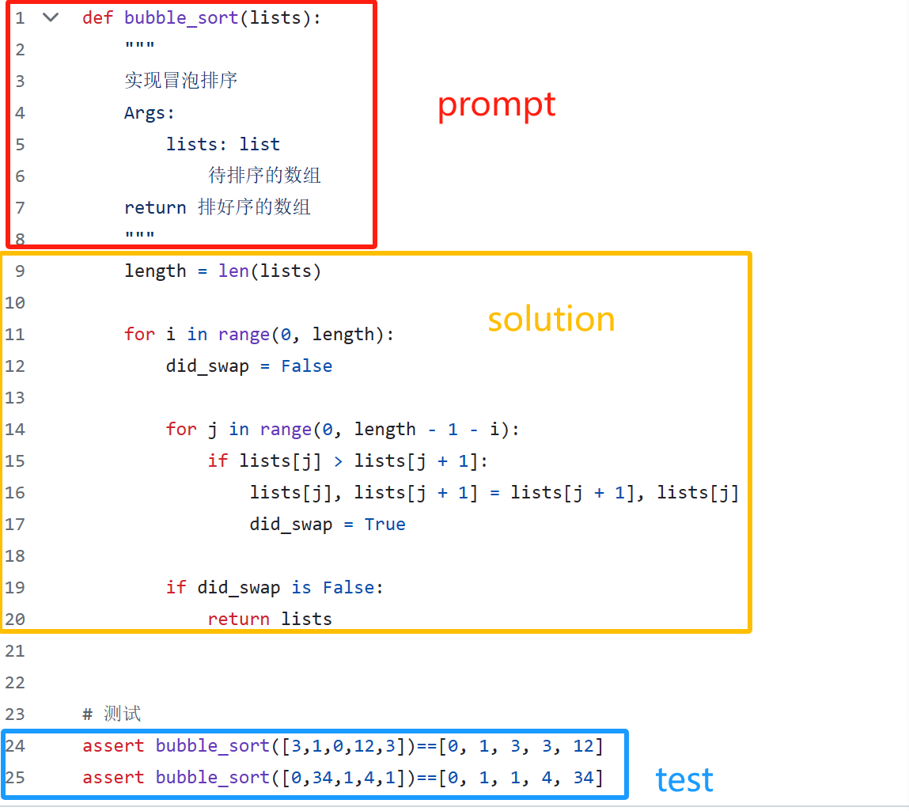

## code测试集构建的数据处理代码

1. 将包含prompt、solution、test的代码放到rawcode.py中。要求prompt、solution共同构建一个可运行的函数。通过test代码可验证函数的正确性

2. 将rawcode.py中的代码，经过construct.py处理为需要的格式。

3. 处理后的数据以jsonl的形式存储在jsoncode.json中

### rawcode.py中的数据说明

1. rawcode.py中的代码需要可运行
2. 应包含'prompt'、'solution'、'test'这3部分。
3. 'prompt'、'solution'合并起来应该是完整的一个或多个函数
4. 'test'的作用是验证模型生成的代码的正确性，样例数量先搞5条左右即可。

